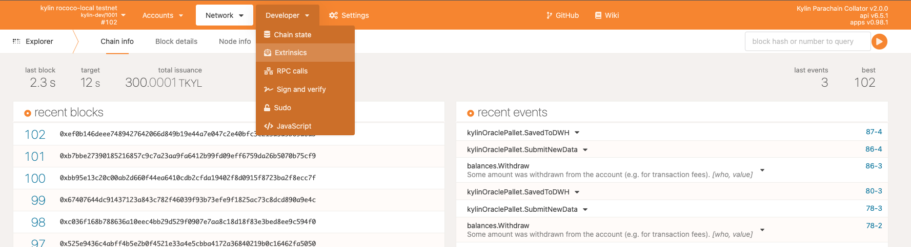
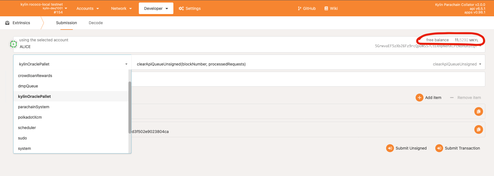
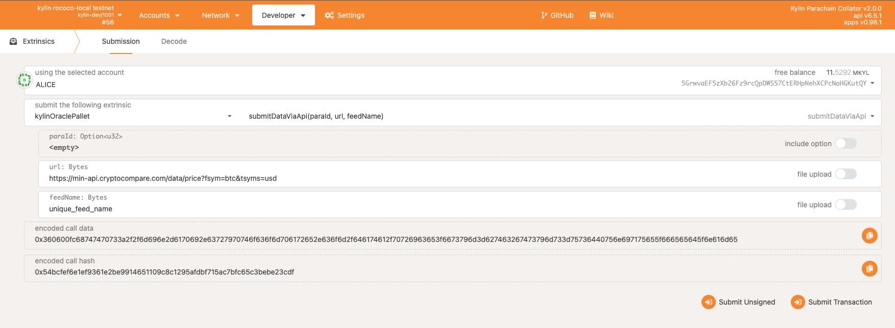
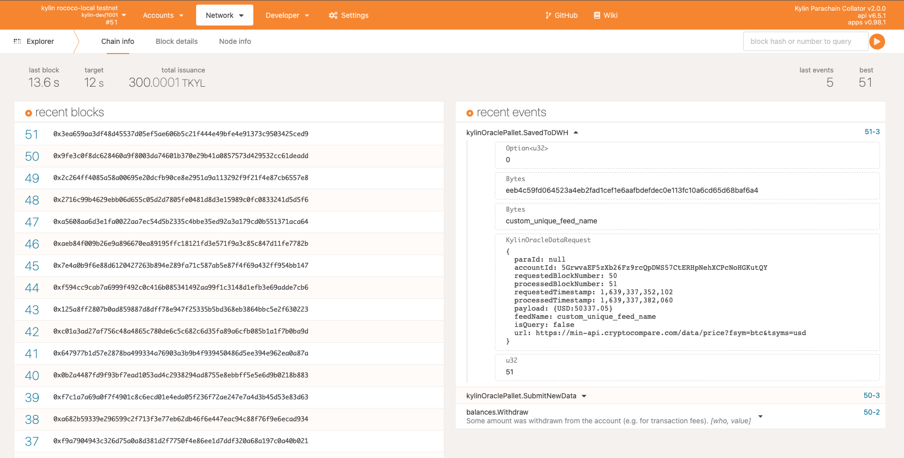
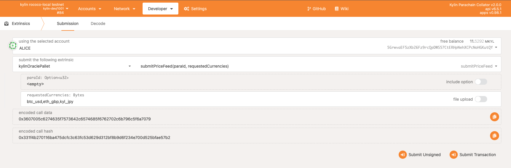
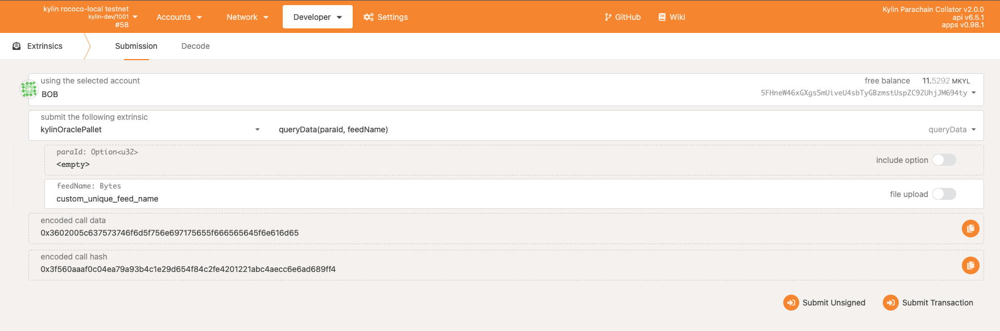
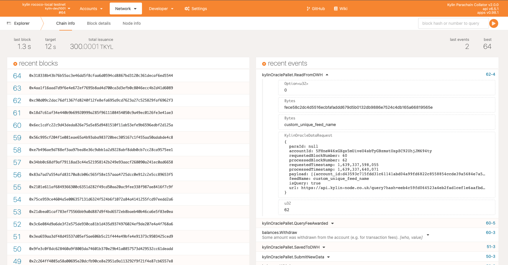
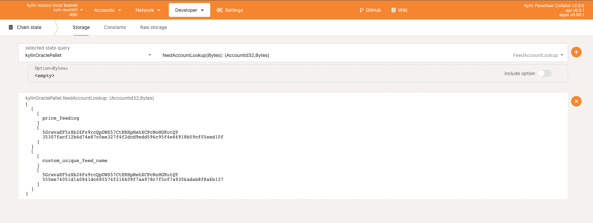

# Kylin Pallet Documentation

The Kylin oracle pallet facilitates read and write operations between the Kylin parachain and the Kylin data warehouse. Anyone holding Kylin's native token (KYL or PCHU) can perform operations.  

To read or write to the warehouse you'll need to submit an extrinsic using the Kylin oracle pallet.

## Find Extrinsics
Inside the Polkadot JS, extrinsics are accessed under the developer tab. Click `Extrinsics` to access the pallet.  



Ensure your account holds the blockchain's native token, then select `kylinOraclePallet` from the dropdown. You are now ready to call an extrinsic.



## Write to Data Warehouse
Data inside the warehouse is stored using feed names. Write extrinsics require a unique feed name which is used to identify the data in storage. The feed name must be unique to all other feed names and will be used later to query the data. To ensure your feed name is unique you can view all active feeds using the [feedAccountLookup](#Feed-Account-Lookup) extrinsic.  

**NOTE: All data submitted to the data warehouse must be JSON serializable. If submitted data is not JSON serializable the write operation will fail and the submitting account will lose their deposit fee.**

#### 1) Submit Data via API  
- The `submitDataViaApi` extrinsic allows you to submit data via any url endpoint. You can create a custom API yourself or use an existing 3rd party API.  

- A `SavedToDWH` event is emited by the blockchain containing the returned data.  


#### 2) Write Data On-Chain  
- The `writeDataOnchain` extrinsics allows you to submit data by hard-coding it into the Polkdot JS user interface.  


#### 3) Submit Price Feed  
- The `submitPriceFeed` extrinsic provides an easy way to store price data. Price data for the currency pairs are aggregated from various different sources.
- Separate currency pairs by comma when submitting multiple. Price data is queried using the `price_feeding` feed name.  


## Read from Data Warehouse
To query data from the warehouse, use the `queryData` extrinsic. All data associated with the passed feed name will be returned.  
- Submit query  

- A `ReadFromDWH` event is emitted by the blockchain containing the returned data.  


## Feed Account Lookup
To get a list of feed names currently in use, use the `feedAccountLookup` query in `Chain State`.  



# Kylin API

The Kylin API is used to as an intermediary between the parachain and data warehouse. When a user submits a write extrinsic, the parachain sends a POST request to the Kylin API which then stores the data in a Postgres database. When a user submits a query extrinsic, the parachain sends a GET request to the Kylin API which returns data specified by the query parameters.

The Kylin API also contains the capabiliy to retrieve aggregated exchange rates from various data providers including Coingecko, Cryptowatch and more.

## Documentation
Interactive Swagger documentation is available [here](https://api.kylin-node.co.uk/). You can submit requests yourself and view real-time responses. Details about the Price API can be found under `/prices` tab. 

## Example Price Query
1. Get current spot price of BTC, ETH and KYL in denominated currencies.
```
https://api.kylin-node.co.uk/prices?currency_pairs=btc_usd,eth_gdp,kyl_jpy
```
