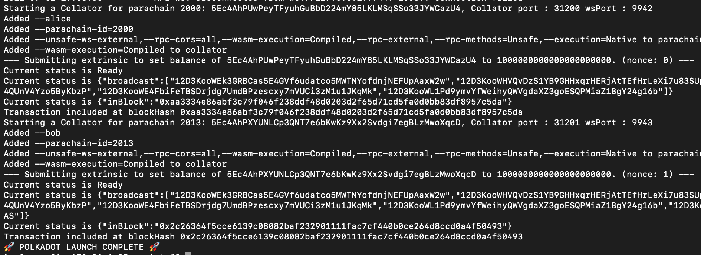
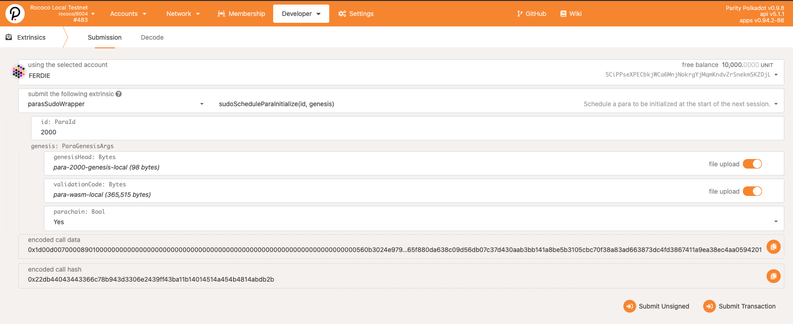
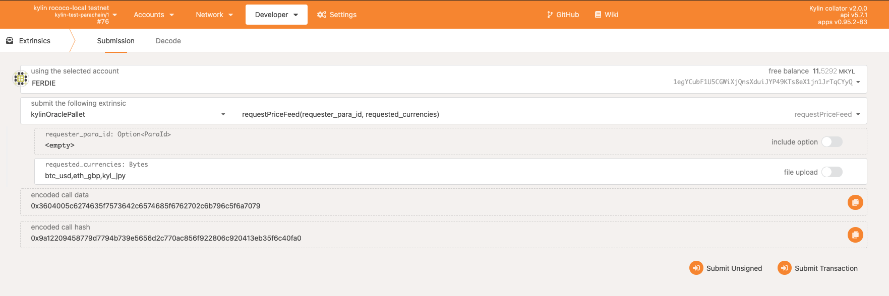

# Kylin Node

Using this repository, you can choose to build and launch the network in multiple ways.

First is to use [Docker](https://www.docker.com/). Composing up with Docker will automatically launch a local network containing multiple validators (polkadot nodes) and collators (kylin nodes) as well as the full user interface on port 3001.

The other way is to build your network from source which again has two ways to do so and is discussed step by step below

## 1) Using Docker

Follow these steps to prepare a local development environment :hammer_and_wrench:

### Setup

You will need to install [Docker](https://www.docker.com/products/docker-desktop) to launch our pre-built containers.

**NOTE:** You are not required to launch your network with Docker, you can build from source if you prefer.

### Run

Launch a local network:

```bash
docker-compose -f scripts/docker-compose.yml up -d
```

The `scripts` directory contains multiple compose files which can be used to launch various network configurations and uses `docker-compose.yml` to launch a local network containing a relaychain with six validators and two kylin parachains. Both parachains are registered to the relaychain and will begin authoring blocks shortly after launch.

Ensure your network is functioning properly
Confirm docker containers are running.
```bash
docker ps
``````
- These container names should have a status of 'up':
    - init-kibana-dashboard
    - insert-ocw
    - kylin-kibana   
    - launch
    - frontend
    - kylin-es
 
Check the container logs:
```bash 
docker logs launch
```
- If the network was launched successfully, you will see something similar to this:

```bash 
docker logs frontend
```

## 2) From Source

- There are two ways you can build from source
  - Manually launching relaychains, parachains and registering it
  - Using the polkadot-launch utility and the configuration file

We will discuss both the approaches in detail.

### Prerequisite for both the approaches

- First, setup your [Rust development environment](https://substrate.dev/docs/en/knowledgebase/getting-started). Then,

- Checkout the code from github and build as shown below

  - kylin-node

    ```bash
    git clone --recursive https://github.com/Kylin-Network/kylin-node.git

    cd kylin-node
    git submodule update --recursive --remote

    cargo build --release
    ```

  - polkadot

    ```bash
    git clone https://github.com/paritytech/polkadot.git

    cd polkadot
    cargo build --release
    ```

### 2a)Launch using Polkadot-Launch Configuration

we can use the `polkadot-launch` utility script to launch our network very simply by provding the custom json configuration file.

- #### Install polkadot-launch

  - We need to have the polkadot launch node script file installed, please run the below command in your terminal

    ```bash
    yarn global add polkadot-launch

    Check installation

    polkadot-launch --version

    ```

- #### Defining the configuration file

  Once we have the `polkadot-launch` utility installed, we need to define the configuration file.

  The configuration files has been provided within the repository inside `scrips-->polkadot_launch-->kylinPolkadotLaunchConfig.json`, you can customize it based on your requirement.

  - There are two sections in the file which are essential: `relaychain` and the `parachains`
  - relaychain: Here we have 3 key parameters to take care

    - bin: Specify the location of the relaychain binary(in our case we build the polkadot in the above step so we can find the binary in the folder `target/release/`). Make sure to provide the absolute path of the binary
    - chain: Specify the type of the chain(in our case we will be using rococo-local as we are launching the local network)
    - nodes: You can specify the number of validators you need to have and their configurations( we have used six validators, feel free to have as per your requirement. But make sure you have atleast two validators). It has name of the validators with some flags and both tcp and websocket exposed port

  - parachains: We have to provide 4 paramters
    - bin: Specify the location of the binary of your parachain
    - id: Specify the Para ID for the chain
    - balance: set initial balance for some of the know account(like alice, bob etc)
    - nodes: nodes configurations for the parachains

- #### Launching the network

```bash
polkadot-launch scripts/polkadot_launch/kylinPolkadotLaunchConfig.json
```

You must wait for the prompt

```bash
🚀 POLKADOT LAUNCH COMPLETE 🚀
```

### 2b) Launch manually

We need to make sure that the prerequisite steps has been done
[Here](#-Prerequisite-for-both-the-approaches)
          prerequsite<a name="Prerequisite for both the approaches"></a>   

#### Create local chain spec

```bash
# Generate rococo-local spec file
./target/release/polkadot build-spec --chain rococo-local --raw --disable-default-bootnode > rococo-local.json
```

#### Start relay chain validators

```bash
# Start Alice
./target/release/polkadot --alice --validator --base-path cumulus_relay/alice --chain rococo-local.json --port 30333 --ws-port 9944

# Start Bob
./target/release/polkadot --bob --validator --base-path cumulus_relay/bob --chain rococo-local.json --port 30334 --ws-port 9943
```
#### Create genesis & WASM files

```bash
cd kylin-node

# Genesis
./target/release/kylin-node export-genesis-state --parachain-id 2000 > para-2000-genesis-local

# WASM
./target/release/kylin-node export-genesis-wasm > para-wasm-local
```

#### Start a collator node

```bash
# Customize the --chain flag for the path to your 'rococo-local.json' file
./target/release/kylin-node --alice --collator --force-authoring --parachain-id 2000 --base-path cumulus_relay/kylin-node --port 40333 --ws-port 8844 -- --execution wasm --chain <path to 'rococo-local.json' file> --port 30343 --ws-port 9942
```

- You should see your collator node running and peering with the already running relay chain nodes.
- Your parachain will not begin authoring blocks until you have registered it on the relay chain.

## Interact

#### Polkadot.js

1. Connect to polkadot.js using a secure frontend connection like [apps](https://github.com/Kylin-Network/apps) or our pre-built `frontend` Docker container.
2. Fill in config in `Settings` -> `Developer`

```js
{
  "Address": "MultiAddress",
  "LookupSource": "MultiAddress",
  "DataInfo": {
    "url": "Text",
    "data": "Text"
  },
  "PriceFeedingData": {
    "para_id": "ParaId",
    "currencies": "Text",
    "requested_block_number": "BlockNumber",
    "processed_block_number": "Option<BlockNumber>",
    "requested_timestamp": "u128",
    "processed_timestamp": "Option<u128>",
    "payload": "Text"
  }
}
```

#### Register the parachain

1. Switch to custom endpoint 9944 for sudo access
2. Select `Developer` -> `Sudo`
3. Submit the following transaction to register your parachain
   

#### Validate the parachain is registered

1. Verify parathread is registered
   - On custom endpoint 9944, select `Network` -> `Parachains`
   - On the parathreads tab you should see your paraid with a lifecycle status of `Onboarding`
   - After onboarding is complete you will see your parachain registered on the Overview tab
2. Verify parachain is producing blocks
   - Navigate to the collator node's custom endpoint 9942
   - Select `Network` -> `Explorer`
   - New blocks are being created if the value of `best` and `finalized` are incrementing higher

#### Submit data request

1. Ensure you are on a collator's custom endpoint, either 9942 or 9943
2. Submit a price request using the `requestPriceFeed` extrinsic
   
