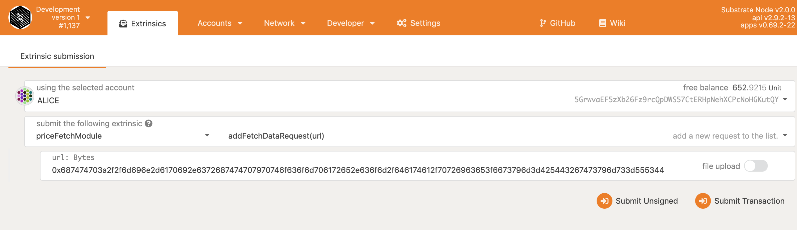
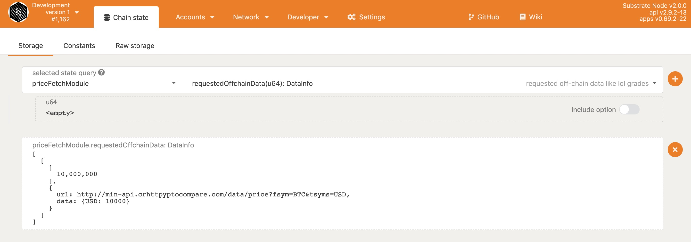

# Kylin Node

## Local Development

Follow these steps to prepare a local development environment :hammer_and_wrench:

### Setup
[Rust development environment](https://substrate.dev/docs/en/knowledgebase/getting-started).


### Build

Checkout code
```bash
git clone --recursive https://github.com/Kylin-Network/kylin-node.git
```

Build debug version

```bash
cd kylin-node
cargo build
```

Build release version

```bash
cd kylin-node
cargo build --release
```

### Docker

Build debug version

```bash
docker build -f Dockerfile -t kylin-node .
docker run -p "9944:9944" -p "9933:9933" -p "9615:9615" -p "30333:30333" kylin-node:latest bash -c "/kylin-node --dev --ws-external --rpc-external --rpc-methods Unsafe"
```


### Interact
Using [Kylin Market Front End](https://github.com/Kylin-Network/kylin-market-frontend) which can be used to interact with Kylin Node.

``` bash
git clone https://github.com/Kylin-Network/kylin-market-frontend.git
cd ./kylin-market-frontend
yarn install
```


## Run

### Development Chain

Purge any existing dev chain state:

```bash
./target/debug/kylin-node purge-chain --dev
```

Start a dev chain:

```bash
./target/debug/kylin-node --dev
```

or, start a dev chain with detailed logging:

```bash
RUST_LOG=debug RUST_BACKTRACE=1 ./target/debug/kylin-node -lruntime=debug --dev
```

### Use `release` version

replace `debug` with `release`.

**Caution! Donot try to run `release` version everytime, it will take lots of time.**


### Using polkadot.js
visit <https://polkadot.js.org/apps/?rpc=ws%3A%2F%2F127.0.0.1%3A9944#/settings/developer>.

fill the config in Settings>>Developer.
```js
{
  "Address": "<AccountId>",
  "LookupSource": "<AccountId>",
  "DataInfo": {
    "url": "Text",
    "data": "Text"
  }
}
```

#### Add OCW Signer
Run `./scripts/insert_alice_key.sh` to insert OCW signer. If the OCW signer does not have enough balance, please charge money as following instructions.

#### Add New Oracle Service URL
Select Developer>>Extrinsics, then using priceFetchModule.addFetchDataRequest(url), type a url encode hex format.


#### Query Oracle Data
Select Developer>>Chain state, then using priceFetchModule.requestedOffchainData(u64), press **+**.

