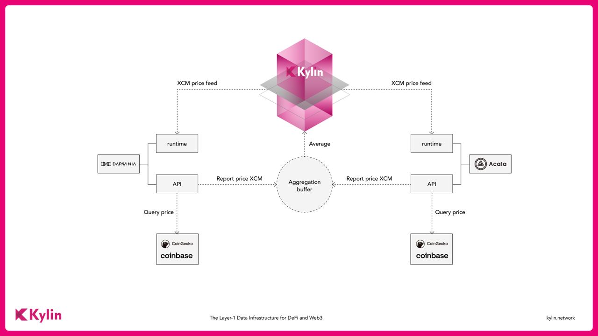

Kylin is building a decentralised oracle system with a configurable framework for democratically creating and managing its oracle system entities.

## Kylin Oracle system vision

- Service level agreement (SLA) between the providers and consumers of data
- Multi-level oracle data agglomeration to balance security, authenticity, persistency and speed
- Transparency and traceability of data provenance
- Democratization of the data management process
- Multi purpose dispute resolution mechanism/ truth machine
- Extra voting rules which can help to assess and strenghten the validity of a vote
- Data and feed ownership management with NFT and metadata
- Free data market

## Kylin Decentralised Oracle Architecture

Other Parachains can easily integrate into Kylin decentralised oracle system with 1 or 2 pallets installed.

For example:

Install *kylin-feed* into parachain runtime will equip the chain with functions to create new feed(with metadata as NFT) and query feed data from Kylin decentralised oracle system:  

- [kylin-feed pallet](https://github.com/Kylin-Network/kylin-collator/tree/main/pallets/kylin-feed)
- How to integrate kylin-feed: [feed-integration](https://github.com/Kylin-Network/kylin-collator/blob/v0.9.30-rococo/doc/feed-integration.md)

Install *kylin-reporter* into parachain runtime will equip the chain with functions to report feed data into Kylin decentralised oracle system:  

- [kylin-reporter pallet](https://github.com/Kylin-Network/kylin-collator/tree/main/pallets/kylin-reporter)
- How to integrate kylin-reporter: [reporter-integration](https://github.com/Kylin-Network/kylin-collator/blob/v0.9.30-rococo/doc/reporter-integration.md)

The cmd tool used to interact with the pallets RPC APIs:

- [kylin-toolbox](https://github.com/Kylin-Network/kylin-toolbox)

A tutorial for demonstrate the Kylin decentralised oracle system

- [oracle workflow demo](https://github.com/Kylin-Network/kylin-collator/blob/v0.9.30-rococo/doc/oracle-workflow.md)

**Our initial MVP(Minimum Viable Product) have achieve following goal:**

- Initially offer aggregation buffer for feed data and reliable agglomerated i64 feeds
- Other parachains can run as feed data providers(with kylin-reporter pallet installed) to provide reliable feed data
- Other parachains can run as feed client to just query feed data they are interesting in
- Users can directly query into Kylin parachain to get reliable feed data
- Provide a running testing platform on rococo network for auditing
  the system before any subsequent work is done.

## Data flow between Kylin and other parachains

